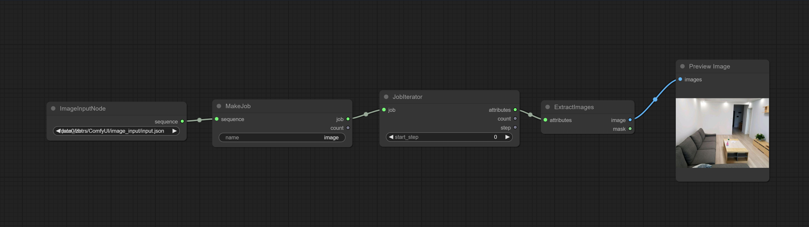

# prompt测试

* 将待处理的json文件放在ComfyUI主目录的model目录下的prompt目录下
* workflow在test.json中
* 在JSONPromptNode中选中json文件
* 在MakeJob中输入用来替代每个prompt的变量名
* 在JobIterator中指定从哪个下标开始
* 在FormatAttributes中组装prompt，可以用变量名代替

# image测试

* 将待处理的json文件放在ComfyUI主目录的model目录下的image目录下
* get_image_input.py在待处理的图片目录下执行可以直接得到所要求的输入json文件
* workflow在test_image.json中
* 在ImageInputNode中选中json文件
* 在MakeJob中随便输入一个字符串
* 在JobIterator中指定从哪个下标开始
* ExtractImages可以输出图片or mask

# 输出文件

* 在CustomImageSave节点指定输出的目录名，生成的结果会保存在output/对应的目录下，并生成一个和目录同名的excel文件
* 需要将prompt字段改为外部输入